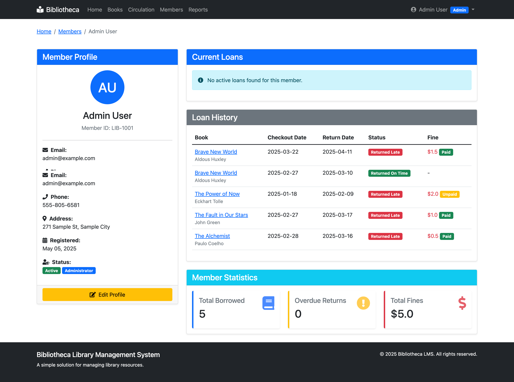
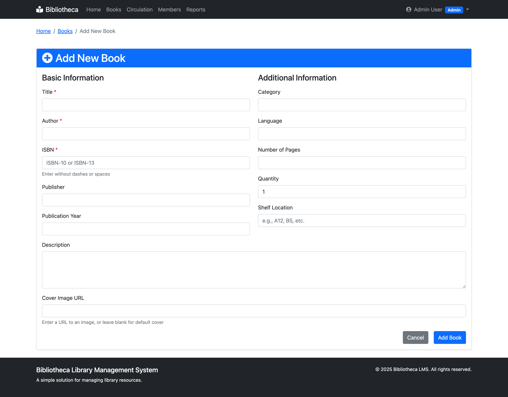
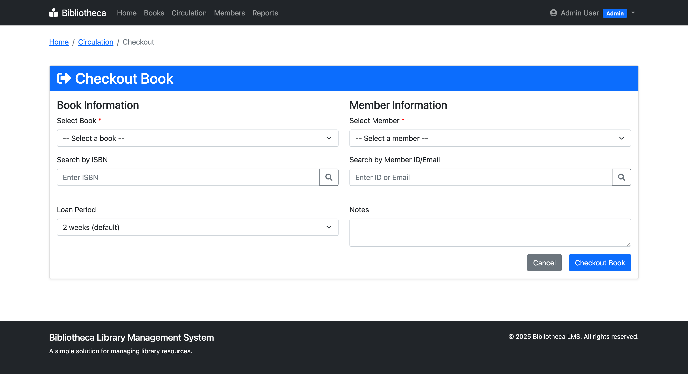

# Bibliotheca: Library Management System


Bibliotheca is a comprehensive library management system built with Flask that helps librarians manage their collections, track circulation, and maintain member records efficiently.

## Screenshots

### Dashboard


### Member Profile


### Adding a New Book


### Book Checkout


### Reports


## Installation Options

### Option 1: Docker Installation (Recommended)

The easiest way to run Bibliotheca across any platform (Windows, macOS, or Linux) is with Docker.

#### Prerequisites
- [Docker](https://docs.docker.com/get-docker/)
- [Docker Compose](https://docs.docker.com/compose/install/)

#### Quick Start with Docker

1. **Clone the repository**
   ```bash
   git clone https://github.com/yourusername/bibliotheca.git
   cd bibliotheca
   ```

2. **Start the application**
   ```bash
   docker-compose up -d
   ```

3. **Access the application**
   Open your browser and navigate to http://localhost:5000

4. **Default login credentials**
   - Admin User: admin@example.com / admin123
   - Regular User: john@example.com / password123

### Option 2: Traditional Installation

#### Prerequisites
- Python 3.10 or higher
- pip (Python package installer)
- Git

#### Setup Instructions

1. **Clone the repository**
   ```bash
   git clone https://github.com/yourusername/bibliotheca.git
   cd bibliotheca
   ```

2. **Create a virtual environment**
   ```bash
   python -m venv venv
   
   # Activate the virtual environment
   # For Windows
   venv\Scripts\activate
   
   # For macOS/Linux
   source venv/bin/activate
   ```

3. **Install dependencies**
   ```bash
   pip install -r requirements.txt
   ```

4. **Set up environment variables**
   ```bash
   # Copy the example environment file
   cp .env.example .env
   
   # Edit .env file with your configuration settings
   # Make sure to generate a strong SECRET_KEY
   ```

5. **Initialize the database**
   ```bash
   # The database will be created when you run the app for the first time
   # To seed the database with sample data:
   python seed_db.py
   ```

6. **Start the development server**
   ```bash
   python run.py
   ```

7. **Access the application**
   Open your browser and navigate to http://localhost:5000

## Features

- **Book Management**
  - Add, edit, and remove books from the library collection
  - Track book details including title, author, ISBN, genre, and more
  - Manage book quantities and locations

- **Member Management**
  - Register new members and maintain their profiles
  - Track contact information and membership status
  - Monitor checkout history and current loans

- **Circulation**
  - Process book checkouts and returns
  - Track due dates and calculate late fees automatically
  - Send notifications for overdue items (optional)

- **Reporting**
  - Generate circulation statistics
  - Inventory reports and book status
  - Overdue book reports and fine collection tracking

- **User-friendly Interface**
  - Responsive design for desktop and mobile
  - Search functionality for books and members
  - Role-based access control (admin/staff/members)

## Detailed Docker Guide

### Development Environment

```bash
# Start the application with live reload
docker-compose up

# Start in detached mode
docker-compose up -d

# View logs
docker-compose logs -f

# Stop the application
docker-compose down
```

### Production Environment

```bash
# Start the production stack with Nginx
docker-compose -f docker-compose.yml -f docker-compose.prod.yml up -d

# Stop the production stack
docker-compose -f docker-compose.yml -f docker-compose.prod.yml down
```

### Database Management

```bash
# To access the database shell
docker-compose exec web flask shell

# To run database migrations
docker-compose exec web flask db upgrade

# To seed the database with sample data
docker-compose exec web python seed_db.py
```

### Container Management

```bash
# Rebuild containers (after making changes)
docker-compose build --no-cache

# View running containers
docker-compose ps

# Execute a command in the web container
docker-compose exec web <command>

# View container logs
docker-compose logs -f web
```

### Docker Configuration Files

- **docker-compose.yml**: Base configuration
- **docker-compose.override.yml**: Development-specific settings (auto-applied)
- **docker-compose.prod.yml**: Production settings with Nginx
- **Dockerfile**: Container build instructions
- **.dockerignore**: Files excluded from the container

### Environment Configurations

- **Development**:
  - Flask debug mode enabled
  - Code hot-reloading
  - Single worker for easier debugging

- **Production**:
  - Nginx for serving static files and load balancing
  - Multiple Gunicorn workers for performance
  - Debug mode disabled
  - Optimized settings for production use

### Cross-Platform Considerations

- **Windows**: For best performance, ensure Docker is using WSL2 backend
- **macOS**: The `:delegated` volume mounts improve filesystem performance
- **Linux**: Works natively with optimal performance
- **All platforms**: Database persistence via Docker volumes

### Troubleshooting Docker Issues

1. **Ports in use**:
   ```bash
   # Check if ports are in use
   lsof -i :5000
   # Stop the container and change the port in docker-compose.yml
   ```

2. **Database access issues**:
   ```bash
   # Check database volume
   docker volume ls
   # Inspect volume 
   docker volume inspect lms_db_data
   ```

3. **Container won't start**:
   ```bash
   # Check for errors
   docker-compose logs web
   ```

4. **Rebuild from scratch**:
   ```bash
   docker-compose down -v
   docker-compose build --no-cache
   docker-compose up -d
   ```

## Project Structure

```
bibliotheca/
├── app/                     # Application package
│   ├── __init__.py          # App initialization
│   ├── config.py            # Configuration settings
│   ├── models/              # Database models
│   ├── routes/              # Route handlers
│   ├── static/              # Static files (CSS, JS, images)
│   ├── templates/           # Jinja2 templates
│   └── utils/               # Utility functions
├── docker-compose.yml       # Base Docker configuration
├── docker-compose.override.yml # Development Docker settings
├── docker-compose.prod.yml  # Production Docker settings
├── Dockerfile               # Docker container definition
├── nginx/                   # Nginx configuration for production
├── requirements.txt         # Python dependencies
├── run.py                   # Application entry point
└── seed_db.py               # Database seeding script
```

## Contributing

Contributions are welcome! Please feel free to submit a Pull Request.

1. Fork the repository
2. Create a new branch (`git checkout -b feature-branch`)
3. Make your changes
4. Commit your changes (`git commit -am 'Add new feature'`)
5. Push to the branch (`git push origin feature-branch`)
6. Create a new Pull Request

## License

This project is licensed under the MIT License - see the LICENSE file for details.

## Acknowledgements

- Flask and its extensions
- SQLAlchemy ORM
- Bootstrap for frontend styling
- Font Awesome for icons
- Docker for containerization
